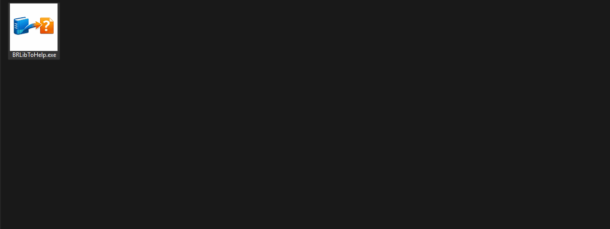
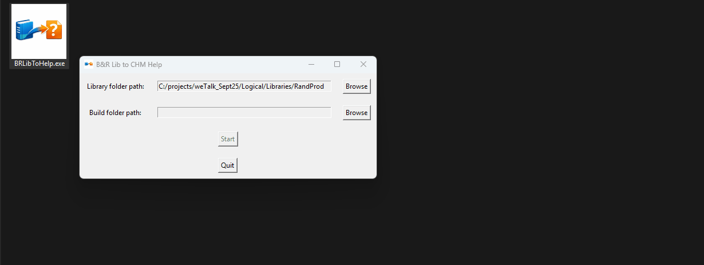
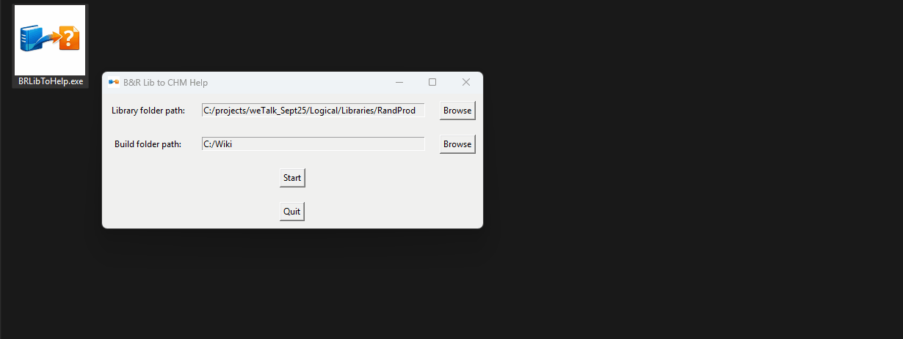
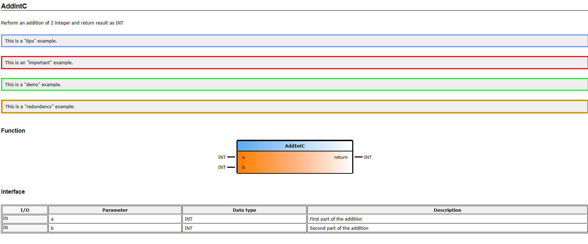

# BRLibToHelp - Usage Guide

This guide demonstrates how to use BRLibToHelp to generate CHM help files for your B&R Automation Studio libraries.

## Table of Contents
- [Running the Application](#running-the-application)
- [Generating CHM Help Files](#generating-chm-help-files)
- [Installing the Help File](#installing-the-help-file)
- [Using F1 Context Help](#using-f1-context-help)
- [Modifying and Rebuilding](#modifying-and-rebuilding)

---

## Running the Application

### Launching BRLibToHelp

Double-click `BRLibToHelp.exe` to launch the application. The main window will appear with two folder selection fields and control buttons.

**GIF NEEDED:** `launch_application.gif`
- Show: Desktop → Double-click BRLibToHelp.exe → Application window opens
- Duration: ~5 seconds



---

## Generating CHM Help Files

### Step 1: Select Library Folder

Click the **Browse** button next to "Library folder path" and navigate to your B&R library folder. The library folder should contain:
- A `.fun` file (function/function block declarations)
- Optional `.typ` files (structures and enumerations)
- Optional `.var` files (constants)

**GIF NEEDED:** `select_library_folder.gif`
- Show: Click "Browse" button → Navigate file explorer to a library folder → Select folder → Path appears in text field
- Duration: ~10 seconds
- Example path to show: `C:\Projects\MyProject\Logical\Libraries\MyLibrary`


### Step 2: Select Build Output Folder

Click the **Browse** button next to "Build folder path" and choose where you want the CHM file and source files to be generated.

**GIF NEEDED:** `select_build_folder.gif`
- Show: Click second "Browse" button → Navigate to desired output location → Select folder → Path appears
- Duration: ~8 seconds
- Example path: `C:\Documentation\Build`



### Step 3: Generate the Documentation

Once both paths are selected, the **Start** button becomes enabled. Click **Start** to begin the generation process.

The application will:
1. Parse all library files
2. Generate HTML documentation
3. Compile the CHM file
4. Display a summary

**GIF NEEDED:** `generate_documentation.gif`
- Show: Both paths selected → Click "Start" button → Processing → Success message box appears with statistics
- Duration: ~15 seconds
- Include: The info message box showing "Functions: X, Function Blocks: Y, etc."



### Step 4: View Results

After generation completes, a dialog asks if you want to open the build folder. Click **Yes** to view the generated files.

**GIF NEEDED:** `view_results.gif`
- Show: Success dialog → Click "Yes" → Windows Explorer opens showing the generated folder structure
- Duration: ~8 seconds
- Show the folder: `Build\LibraryName\chm\` with CHM file visible


---

## Installing the Help File

### Creating the Help Folder in Your Library

To enable F1 context-sensitive help in Automation Studio, you need to place the CHM file in a specific location within your library.

**GIF NEEDED:** `install_help_file.gif`
- Show: 
  1. Navigate to library folder in Windows Explorer
  2. Create new folder named "Help"
  3. Copy the `LibYourLibrary.chm` file from build folder
  4. Paste into the Help folder
- Duration: ~15 seconds
- Show folder structure before and after


**Folder Structure:**
```
<YourLibrary>/
├── <YourLibrary>.fun
├── <YourLibrary>.typ
├── <YourLibrary>.var
└── Help/
    └── Lib<YourLibrary>.chm  ← Place CHM file here
```

> **Important:** The CHM filename must match the pattern `Lib<YourLibraryName>.chm`

---

## Using F1 Context Help

### Opening Help in Automation Studio

Once the CHM file is installed in the Help folder, you can use F1 to access context-sensitive help directly from Automation Studio.

**GIF NEEDED:** `f1_help_function_block.gif`
- Show:
  1. Automation Studio with library visible in Logical View
  2. Click to select a function block in the project tree or code editor
  3. Press F1 key
  4. CHM help opens to the exact function block page
- Duration: ~10 seconds
- Highlight: Cursor on FB name → Press F1 → Help window opens


**GIF NEEDED:** `f1_help_in_code.gif`
- Show:
  1. Structured text editor with library functions being used
  2. Place cursor on a function/FB name in code
  3. Press F1
  4. Help opens to that specific item
- Duration: ~10 seconds


### What You Can Get Help For

F1 context help works for:
- ✅ Function Blocks
- ✅ Functions
- ✅ Structures (data types)
- ✅ Enumerations
- ✅ Constants

---

## Modifying and Rebuilding

### Editing the HTML Source

If you need to make changes to the documentation, you can edit the HTML files and rebuild without regenerating everything.

**GIF NEEDED:** `edit_and_rebuild.gif`
- Show:
  1. Navigate to `build\LibraryName\chm\` folder
  2. Open an HTML file (e.g., `FBKs\SomeFunction.html`) in a text editor
  3. Make a visible change (add text or modify description)
  4. Save the file
  5. Double-click `build_LibLibraryName.bat`
  6. CMD window shows compilation
  7. Open the CHM file to verify the change
- Duration: ~20 seconds


### Using the Rebuild Batch File

The generated folder contains a `build_Lib<LibraryName>.bat` file that recompiles the CHM:

```
build/LibraryName/chm/
├── build_LibLibraryName.bat  ← Double-click to rebuild
├── LibLibraryName.chm
├── hhc.exe
└── [HTML files]
```

> **Note:** Only use the batch file for minor HTML edits. If you add/remove functions or function blocks, regenerate using the main application.

---

## Browsing the CHM File

### Navigating the Help File

The generated CHM file has three main sections accessible via the navigation pane:

**GIF NEEDED:** `browse_chm_structure.gif`
- Show:
  1. Open CHM file by double-clicking
  2. Use the Contents tab to navigate tree structure
  3. Click on "Functions and Function Blocks" to expand
  4. Click on a specific function to view its page
  5. Switch to Index tab and search for a term
  6. Switch to Search tab and perform a search
- Duration: ~20 seconds


### Contents Tree

- **General** - Overview and library description
- **Functions and Function Blocks** - All executable elements
- **Data Types and Constants** - Structures, enumerations, and constants

### Using Search

The CHM file includes full-text search functionality:
1. Click the **Search** tab
2. Enter a search term
3. Click **List Topics**
4. Select a result to view

---

## Troubleshooting

### CHM File Won't Open or Shows Blank Pages

**Problem:** The CHM file opens but shows "Navigation to the webpage was canceled" or blank pages.

**Solution:** Windows blocks CHM files from network locations or untrusted sources.

**GIF NEEDED:** `unblock_chm_file.gif`
- Show:
  1. Right-click on CHM file → Properties
  2. At bottom of General tab, show the "Security: This file came from another computer..." message
  3. Check the "Unblock" checkbox
  4. Click OK
  5. Open CHM file again showing it now works
- Duration: ~12 seconds


### F1 Help Not Working

**Checklist:**
- ✅ CHM file is in the `Help/` folder inside your library
- ✅ CHM filename matches pattern: `Lib<LibraryName>.chm`
- ✅ Library is properly added to your Automation Studio project
- ✅ CHM file has been unblocked (see above)
- ✅ Element name is selected when pressing F1

---

## Tips and Best Practices

### Documentation Maintenance

1. **Version Control**: Keep CHM files in sync with library versions
2. **Update Regularly**: Regenerate documentation when functions/FBs change
3. **Test F1 Help**: Verify key functions have working help before release
4. **Meaningful Descriptions**: Add comments in your source code - they appear in the help

### Custom Styling

You can add special CSS classes to HTML files for enhanced documentation:

```html
<p class="tips">Useful tip information</p>
<p class="important">Critical information</p>
<p class="demo">Demo or example content</p>
<p class="redundancy">Redundancy-related information</p>
```



---

## Summary

You've learned how to:
- ✅ Generate CHM help files from B&R libraries
- ✅ Install help files for F1 integration
- ✅ Use context-sensitive help in Automation Studio
- ✅ Edit and rebuild documentation
- ✅ Troubleshoot common issues

For more information, see:
- [README.md](README.md) - Project overview and setup
- [BUILD_INSTRUCTIONS.md](BUILD_INSTRUCTIONS.md) - Building the executable

---

**Need Help?** Open an issue on GitHub or consult the B&R Automation Studio documentation.
